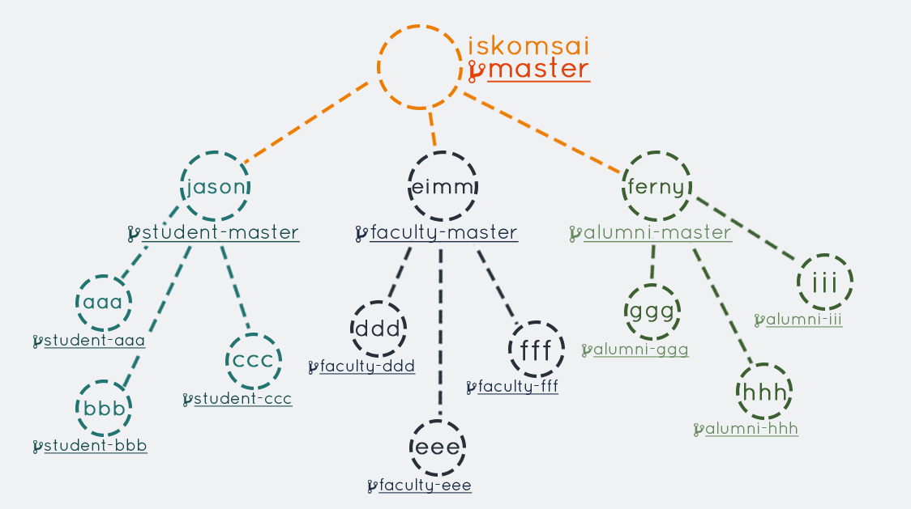
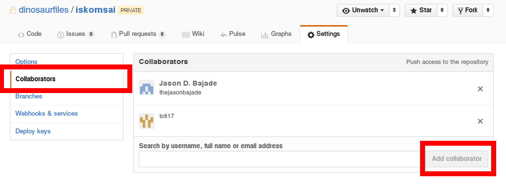
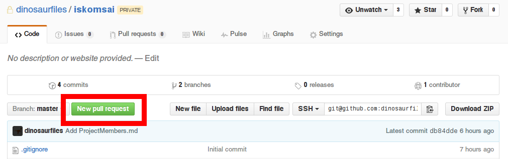
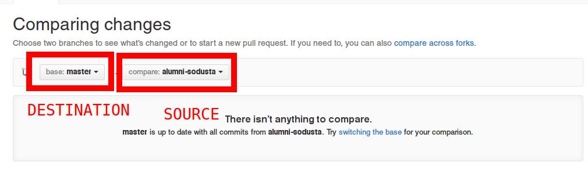

# Instructions

## Git Flow as shown below

### Instructions for **Team Leaders**
- Clone the `iskomsai` [repository](https://github.com/dinosaurfiles/iskomsai.git).
- Make a new `branch` with the corresponding name `<module_name>-master` (E.g. `faculty-master`, `student-master`, etc.).

    *This is where the code of all group members go.*

- Add your team members as a collaborator.

    

`Note:` Pull requests should be made when a feature is implemented successfully or not known bugs are found.

### Instructions for **All Members**
- Clone the repository of your team leader and check if you have access to the repository.
- Create a new `branch` with the corresponding name `<module_name>_<yourname>` (E.g. `faculty-aaa`, `student-bbb`, etc.).
- Make changes in the [`ProjectMembers.md`](ProjectMembers.md) file by inserting your name on your respective module.

    *This is actually a test to see if you can read/write on the repository*

- Do the `add-commit-push` git cycle.
   - git add
   - git commit
   - git push

- On Github make a pull request with your team leader by selecting your own branch (`faculty-aaa`) and the team leader's `<module_name>_master` branch.
Wait for the team leader to accept your pull request.

    
    *On the homepage*

    
    *Add an on-spot title and description*

- the **Team Leader** will have to wait until the all the team members have added their name on the `ProjectMembers.md` file.

- Watch your name get merged on the **main repository**.

## Done and Congrats! YEY !
*This is a sample test to apply your learned git skills such as the basic add-commit-push, and handling of merges conflicts.*

#### Having issues or need relationship advice? Catch us up on the #git channel on [Slack!](https://iskomsai.slack.com) :)
